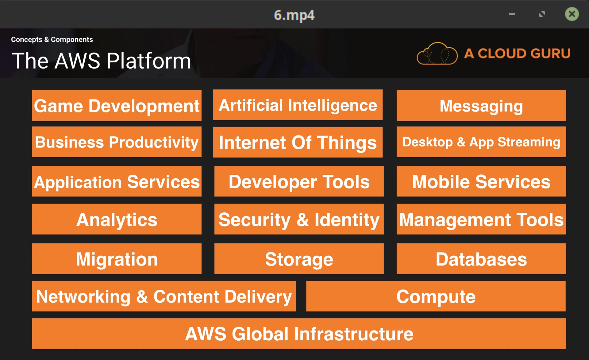

## AWS Overview

- **AWS Global Infrastructure**
  - Regions : Geographical area
  - Availability Zone : Data Center
  - Edge Locations : CDN end points for CloudFront
- **Networking & Content Delivery**
  - VPC : Virtual Private Cloud
  - Route53 : DNS Service
  - Cloud Front : Edge Locations
  - Direct Connect : direct p2p link to aws
- **Compute**
  - EC2
  - EC2 Container Service
  - Elastic Beanstalk
  - Lambda
- **Storage**
  - S3 :  Simple Storage Services (Object Based)
  - Glacier : Data Archive
  - EFS : Elastic File Service
  - Storage Gateway : A VMs to connect to S3
- **Databases**
  - RDS : Relational Database System
  - DynamoDB : NoSQL DB
  - Redshift : Data warehouse
  - Elasticache : caching
- **Migration**
  - Snowball
  - DMS : Database Migration Services
  - Server Migration Service (SMS) : Migrate vmware virtual machines
- **Analytics**
  - Athena
  - EMR : Elastic Map Reduce (hadoop, apache spark)
  - Cloud Search
  - Elastic Search
  - Kinesis : Streaming and analyzing real time data.
  - Data Pipeline
  - Quick Sight : business analytics tool
- **Security & Identity**
  - IAM : Identity Access Management
  - Inspector : Agent on VM
  - Certificate Manager : free SSL Certificate
  - Directory Service : Connect AD with AWS
  - WAF : Web Application Firewall
  - Artifact : Compliance Certifications
- **Management Tools**
  - Cloud Watch : Monitor performance
  - Cloud Formation : Infrastructure to code
  - Cloud Trail : Auditing changes in AWS
  - Opsworks : automating deployments using chef
  - Config : Set alerts
  - Service Catalog 
  - Trusted Advisor
- Application Services
  - Step Functions
  - SWF : Simple Work Flow 
  - API Gateway
  - AppStream
  - Elastic Transcoder
- Developer Tools
  - CodeCommit
  - CodeBuild
  - CodeDeploy
  - CodePipeline
- Mobile Services
  - Mobile Hub
  - Cognito
  - Device Farm
  - Mobile Analytics
  - Pinpoint
- Business Productivity
  - WorkDocks
  - WorkMail
- Internet Of Things
- **Desktop & App Streaming**
  - WorkSpaces
  - AppStream 2.0
- Artificial Intelligence
  - lex (alexa)
  - Polly
  - Machine Learning
  - Rekognition
- **Messaging**
  - SNS : Simple Notification Service
  - SQS : Simple Queue Service
  - SES : Simple Email Service