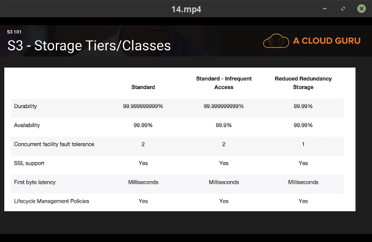

## S3
- It is Object based storage.
- Files can be from 0 Bytes to 5 TB
- S3 is a universal namespace, that is, names must be unique globally
  - https://s3-<region>.amazonaws.com/<bucketname>
- unlimited storage
- On successful upload we get HTTP 200
- Read after write consistency for PUTS of new Object
- Eventual Consistency for overwrite PUTS and DELETES (can take some time to propagate)

### S3 storage classes

- S3
  - 99.99% availability
  - 99.999999999% durability
- S3-IA (Infrequently Accessed)
- Reduced Redundancy Storage (99.99% durability and 99.99% availability)
- Glacier Very cheap, for archival only takes 3-5 hours to restore.

### S3 - Charges
- Storage
- Requests
- Storage Management Pricing
- Data Transfer Pricing
- Transfer Accelerations

### The core fundamentals of an S3
- Key (name)
- Value (data)
- Version ID
- Metadata
- Sub Resources
  - ACL
  - Torrent